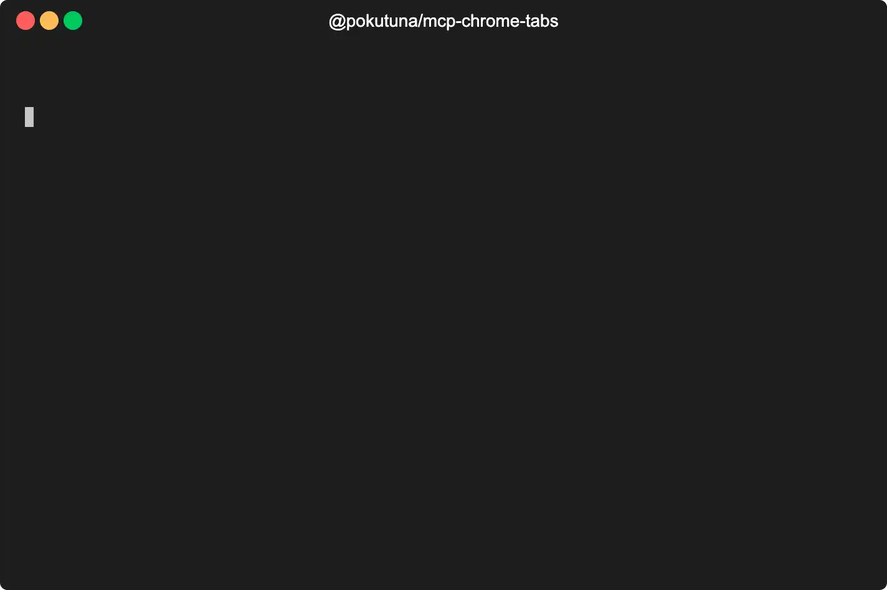

# @pokutuna/mcp-chrome-tabs

[](https://badge.fury.io/js/@pokutuna%2Fmcp-chrome-tabs)

Model Context Protocol (MCP) server that provides direct access to your browser's open tabs content. No additional fetching or authentication required - simply access what you're already viewing.



## Key Features

- **Direct browser tab access** - No web scraping needed, reads content from already open tabs
- **Content optimized for AI** - Automatic content extraction and markdown conversion to reduce token usage
- **Active tab shortcut** - Instant access to currently focused tab without specifying IDs
- **MCP listChanged notifications** - Follows MCP protocol to notify tab changes (set `--check-interval` to enable)

## Requirements

> [!IMPORTANT]  
> **macOS only** - This MCP server uses AppleScript and only works on macOS.

- **Node.js** 20 or newer
- **MCP Client** such as Claude Desktop, Claude Code, or any MCP-compatible client
- **macOS** only (uses AppleScript for browser automation)

## Getting Started

First, enable "Allow JavaScript from Apple Events" in Chrome:

- (en) **View** > **Developer** > **Allow JavaScript from Apple Events**
- (ja) **表示** > **開発 / 管理** > **Apple Events からの JavaScript を許可**

When you first use the MCP server, macOS will prompt you to grant AppleScript automation permission to your MCP client (e.g., Claude Desktop, Claude Code). Click **OK** to allow access to Chrome. If you accidentally dismissed the dialog, you can enable it in **System Settings** > **Privacy & Security** > **Automation**.

Standard config works in most MCP clients (e.g., `.claude.json`, `.mcp.json`):

```json
{
  "mcpServers": {
    "chrome-tabs": {
      "command": "npx",
      "args": ["-y", "@pokutuna/mcp-chrome-tabs@latest"]
    }
  }
}
```

Or for Claude Code:

```bash
claude mcp add -s user chrome-tabs -- npx -y @pokutuna/mcp-chrome-tabs@latest
```

### Claude Code Plugin

You can also install this as a Claude Code plugin:

```bash
# Add the marketplace
/plugin marketplace add pokutuna/mcp-chrome-tabs

# Install the plugin
/plugin install mcp-chrome-tabs@mcp-chrome-tabs
```

### Command Line Options

The server accepts optional command line arguments for configuration:

**Content Extraction Options**
- `--max-content-chars` - Maximum content characters per single read (default: 20000)
- `--extraction-timeout` - Timeout for content extraction worker in milliseconds (default: 20000)
- `--exclude-hosts` - Comma-separated list of domains to exclude from tab listing and content access

**Resource Options**
- `--check-interval` - Interval in milliseconds to check for tab changes and send listChanged notifications (default: 0 disabled, set to 3000 for 3 seconds)

**Browser Options**
- `--application-name` - Application name to control (default: "Google Chrome")
- `--experimental-browser` - Browser implementation to use: "chrome", "safari", or "arc" (default: "chrome")

**Other Options**
- `--help` - Show help message with all available options

### Resource Subscription (Optional)

Setting `--check-interval` to a value greater than 0 enables resource subscription. When enabled, the server monitors tab list changes and sends MCP `listChanged` notifications to prompt clients to refresh their resource lists. This also makes `tab://{windowId}/{tabId}` resources available for all open tabs.

In 2025-10, few MCP clients support resource subscriptions. Resource subscription is disabled by default (`--check-interval=0`). Most users only need the `tab://current` resource, which is always available.

To enable resource subscription:

```json
{
  "mcpServers": {
    "chrome-tabs": {
      "command": "npx",
      "args": [
        "-y",
        "@pokutuna/mcp-chrome-tabs@latest",
        "--check-interval=3000"
      ]
    }
  }
}
```

## Other Browser Support (Experimental)

### Safari

Note that Safari lacks unique tab IDs, making it sensitive to tab order changes during execution:

```bash
npx @pokutuna/mcp-chrome-tabs --application-name=Safari --experimental-browser=safari
```

### Arc

```bash
npx @pokutuna/mcp-chrome-tabs --application-name=Arc --experimental-browser=arc
```

## MCP Features

### Tools

<details>
<summary><code>list_tabs</code></summary>

List all open tabs in the user's browser with their titles, URLs, and tab references.

- Returns: Markdown formatted list of tabs with tab IDs for reference

</details>

<details>
<summary><code>read_tab_content</code></summary>

Get readable content from a tab in the user's browser.

- `id` (optional): Tab reference from `list_tabs` output (e.g., `ID:12345:67890`)
- If `id` is omitted, uses the currently active tab
- Returns: Clean, readable content extracted using Mozilla Readability

</details>

<details>
<summary><code>open_in_new_tab</code></summary>

Open a URL in a new tab to present content or enable user interaction with webpages.

- `url` (required): URL to open in the browser
- Returns: Tab ID in format `ID:windowId:tabId` for immediate access to the new tab

</details>

### Resources

<details>
<summary><code>tab://current</code></summary>

Resource representing the content of the currently active tab.

- **URI**: `tab://current`
- **MIME type**: `text/markdown`
- **Content**: Real-time content of the active browser tab
- **Always available** regardless of `--check-interval` setting

</details>

<details>
<summary><code>tab://{windowId}/{tabId}</code></summary>

Resource template for accessing specific tabs.

- **URI pattern**: `tab://{windowId}/{tabId}`
- **MIME type**: `text/markdown`
- **Content**: Content of the specified tab
- **Availability**: Only when `--check-interval` is set to a value greater than 0
- Resources are dynamically generated based on currently open tabs
- When enabled, the server monitors tab changes and sends MCP listChanged notifications

</details>

## Troubleshooting

### `Current Tabs (0 tabs exists)` is displayed

Ensure "Allow JavaScript from Apple Events" is enabled in Chrome (see [Getting Started](#getting-started)).

If it was working before, try restarting your browser.
