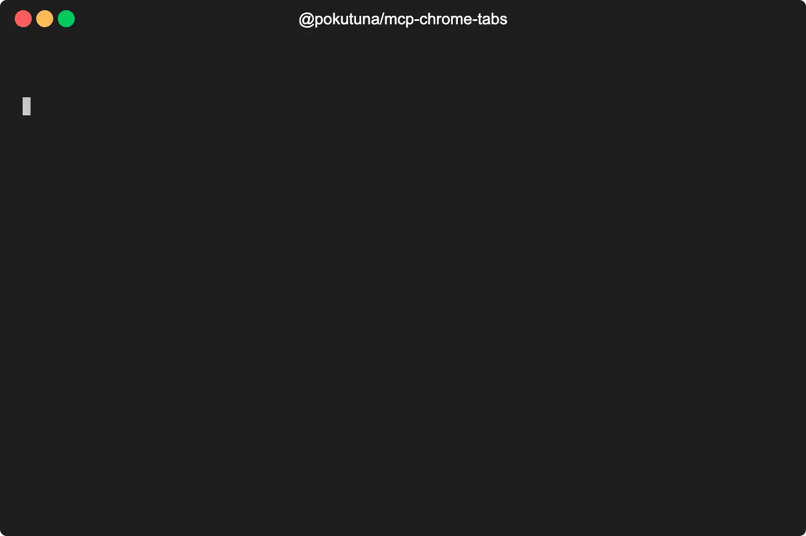

# @pokutuna/mcp-chrome-tabs

[](https://badge.fury.io/js/@pokutuna%2Fmcp-chrome-tabs)

Model Context Protocol (MCP) server that provides direct access to your browser's open tabs content. No additional fetching or authentication required - simply access what you're already viewing.



## Key Features

- **Direct browser tab access** - No web scraping needed, reads content from already open tabs
- **Content optimized for AI** - Automatic content extraction and markdown conversion to reduce token usage
- **Active tab shortcut** - Instant access to currently focused tab without specifying IDs
- **MCP listChanged notifications** - Follows MCP protocol to notify tab changes (set `--check-interval` to enable)

## Requirements

> [!IMPORTANT]  
> **macOS only** - This MCP server uses Apple Events (JXA) and only works on macOS.

- **Node.js** 22 or newer
- **MCP Client** such as Claude Desktop, Claude Code, or any MCP-compatible client
- **macOS** only (uses Apple Events via JXA for browser automation)

## Getting Started

First, enable "Allow JavaScript from Apple Events" in Chrome:

- (en) **View** > **Developer** > **Allow JavaScript from Apple Events**
- (ja) **表示** > **開発 / 管理** > **Apple Events からの JavaScript を許可**

When you first use the MCP server, macOS will prompt you to grant Automation permission to your MCP client (e.g., Claude Desktop, Claude Code). Click **OK** to allow access to Chrome. If you accidentally dismissed the dialog, you can enable it in **System Settings** > **Privacy & Security** > **Automation**.

When multiple Google Chrome processes exist, JXA generally selects the oldest process, but this is not a guaranteed process-selection API. Start your normal Chrome before starting other Chrome instances when process identity matters.

Standard config works in most MCP clients (e.g., `.claude.json`, `.mcp.json`):

```json
{
  "mcpServers": {
    "chrome-tabs": {
      "command": "npx",
      "args": ["-y", "@pokutuna/mcp-chrome-tabs@latest"]
    }
  }
}
```

Or for Claude Code:

```bash
claude mcp add -s user chrome-tabs -- npx -y @pokutuna/mcp-chrome-tabs@latest
```

### Claude Code Plugin

You can also install this as a Claude Code plugin:

```bash
# Add the marketplace
/plugin marketplace add pokutuna/mcp-chrome-tabs

# Install the plugin
/plugin install mcp-chrome-tabs@mcp-chrome-tabs
```

### Command Line Options

The package also provides read-only commands for accessing the same tab data as
the MCP tools:

```bash
# List open tabs as: [INDEX] ID TITLE DOMAIN (* marks the active tab)
npx @pokutuna/mcp-chrome-tabs list

# Show the full URL in place of the domain
npx @pokutuna/mcp-chrome-tabs list --include-url

# Read the active tab
npx @pokutuna/mcp-chrome-tabs read --active

# Read a specific tab from an ID returned by list
npx @pokutuna/mcp-chrome-tabs read ID:12345:67890

# Read by INDEX from the list instead
npx @pokutuna/mcp-chrome-tabs read 2

# Continue reading truncated content
npx @pokutuna/mcp-chrome-tabs read ID:12345:67890 --offset=20000
```

`list` prints an INDEX column for reading the listing at a glance, but it
numbers that one listing only -- it shifts when tabs open or close. Windows
are ordered by ID (creation order) rather than front to back, so switching
windows does not renumber the list. `read <INDEX>` re-resolves the index when
it runs, so it can land on a different tab than you saw; pass the ID when that
matters. An argument starting with `ID:` is taken as an ID, and a bare number
as an INDEX.

Reading refuses a browser that is not running rather than launching it;
`open_in_new_tab` still launches it.

Running the command without a subcommand starts the MCP server.
Options apply to the commands shown below; passing one to a command it does
not apply to is an error.

**List Options**

- `--include-url` - Show the full URL instead of the domain

**Read Options**

- `--active` - Read the tab you are looking at now. `read` needs one of an ID, an INDEX, or `--active`
- `--offset` - Start reading content at this character offset (default: 0)

**Content Options** (`read` and the MCP server)

- `--max-content-chars` - Maximum content characters per single read (default: 20000)
- `--extraction-timeout` - Timeout for content extraction worker in milliseconds (default: 20000)

**MCP Server Options**

- `--check-interval` - Interval in milliseconds to check for tab changes and send listChanged notifications (default: 0 disabled, set to 3000 for 3 seconds)

**Common Options** (all commands)

- `--exclude-hosts` - Comma-separated list of domains to exclude from tab listing and content access. Hosts in the `MCP_CHROME_TABS_EXCLUDE_HOSTS` environment variable are excluded as well
- `--application-name` - Application name to control (default: "Google Chrome")
- `--experimental-browser` - Browser implementation to use: "chrome", "safari", or "arc" (default: "chrome")
- `--help` - Show help message with all available options
- `--version` - Show the package version

### Who Can Read Your Tabs

Anything that runs as your user and has Automation permission for the browser
can read your tabs, with or without this package. Keep the following in mind
when using the commands above:

- `list` and `read` do not go through your MCP client's tool approval. Any
  process or agent that can run shell commands can call them.
- macOS grants Automation permission to the app that starts the process, such
  as your terminal. If you allowed it once for the MCP server, commands run
  from the same app get it too.
- `--exclude-hosts` applies only to the process it is passed to. Hosts
  excluded in your MCP client config are not excluded for command line runs.
  To exclude hosts everywhere, set `MCP_CHROME_TABS_EXCLUDE_HOSTS` in your
  shell profile (e.g. `export MCP_CHROME_TABS_EXCLUDE_HOSTS="mail.google.com"`).
  Either way, it filters what this package returns; it does not control access.

To block access entirely, turn off the browser under System Settings > Privacy
& Security > Automation for the app in question.

#### Asking before a coding agent reads a tab

A coding agent with shell access can run `list` and `read`, or `osascript`
directly, without the MCP tool approval. Its permission rules can require a
confirmation for these commands, even in an auto-approve mode. The rules match
the command text, so an agent that reaches the same program another way (for
example `/usr/bin/osascript`) is not caught; they are a checkpoint, not access
control.

Claude Code (`~/.claude/settings.json`; use `deny` instead of `ask` to block):

```json
{
  "permissions": {
    "ask": [
      "Bash(mcp-chrome-tabs *)",
      "Bash(npx *mcp-chrome-tabs*)",
      "Bash(osascript *)"
    ]
  }
}
```

Codex CLI (`~/.codex/rules/default.rules`; use `"forbidden"` to block):

```starlark
prefix_rule(pattern = ["mcp-chrome-tabs"], decision = "prompt")
prefix_rule(pattern = ["npx", "@pokutuna/mcp-chrome-tabs"], decision = "prompt")
prefix_rule(pattern = ["npx", "-y", "@pokutuna/mcp-chrome-tabs"], decision = "prompt")
prefix_rule(pattern = ["osascript"], decision = "prompt")
```

### Resource Subscription (Optional)

Setting `--check-interval` to a value greater than 0 enables resource subscription. When enabled, the server monitors tab list changes and sends MCP `listChanged` notifications to prompt clients to refresh their resource lists. This also makes `tab://{windowId}/{tabId}` resources available for all open tabs.

In 2025-10, few MCP clients support resource subscriptions. Resource subscription is disabled by default (`--check-interval=0`). Most users only need the `tab://current` resource, which is always available.

To enable resource subscription:

```json
{
  "mcpServers": {
    "chrome-tabs": {
      "command": "npx",
      "args": [
        "-y",
        "@pokutuna/mcp-chrome-tabs@latest",
        "--check-interval=3000"
      ]
    }
  }
}
```

## Other Browser Support (Experimental)

### Safari

Reading page content requires **Develop** > **Allow JavaScript from Apple Events** in Safari. Note that Safari lacks unique tab IDs, making it sensitive to tab order changes during execution:

```bash
npx @pokutuna/mcp-chrome-tabs --application-name=Safari --experimental-browser=safari
```

### Arc

```bash
npx @pokutuna/mcp-chrome-tabs --application-name=Arc --experimental-browser=arc
```

## MCP Features

### Tools

<details>
<summary><code>list_tabs</code></summary>

List all open tabs in the user's browser with their titles, URLs, and tab references.

- Returns: Markdown formatted list of tabs with tab IDs for reference

</details>

<details>
<summary><code>read_tab_content</code></summary>

Get readable content from a tab in the user's browser.

- `id` (optional): Tab reference from `list_tabs` output (e.g., `ID:12345:67890`)
- If `id` is omitted, uses the currently active tab
- Returns: Clean, readable content extracted using Mozilla Readability

</details>

<details>
<summary><code>open_in_new_tab</code></summary>

Open a URL in a new tab to present content or enable user interaction with webpages.

- `url` (required): URL to open in the browser
- Returns: Tab ID in format `ID:windowId:tabId` for immediate access to the new tab

</details>

### Resources

<details>
<summary><code>tab://current</code></summary>

Resource representing the content of the currently active tab.

- **URI**: `tab://current`
- **MIME type**: `text/markdown`
- **Content**: Real-time content of the active browser tab
- **Always available** regardless of `--check-interval` setting

</details>

<details>
<summary><code>tab://{windowId}/{tabId}</code></summary>

Resource template for accessing specific tabs.

- **URI pattern**: `tab://{windowId}/{tabId}`
- **MIME type**: `text/markdown`
- **Content**: Content of the specified tab
- **Availability**: Only when `--check-interval` is set to a value greater than 0
- Resources are dynamically generated based on currently open tabs
- When enabled, the server monitors tab changes and sends MCP listChanged notifications

</details>

## Troubleshooting

### `Current Tabs (0 tabs exists)` is displayed

Ensure "Allow JavaScript from Apple Events" is enabled in Chrome (see [Getting Started](#getting-started)).

If it was working before, try restarting your browser.
